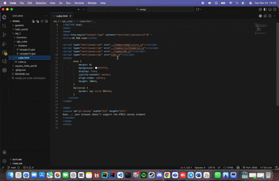
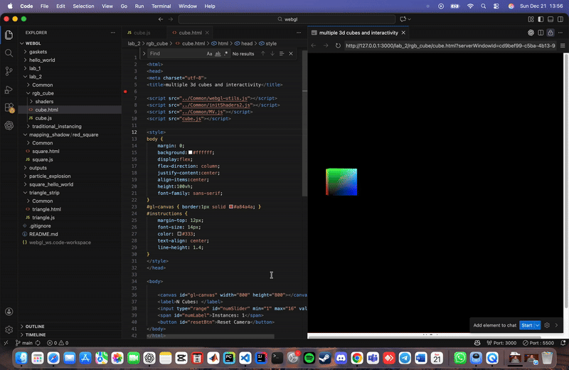

# Computer Graphics Projects

This repository contains all the projects, assignments, and experiments I completed during the Computer Graphics course taken as part of the Erasmus Mundus Joint Master’s Programme *IMAGING – Immersive Imaging Track*.  
The course was delivered at Mid Sweden University (MIUN) as a component of the advanced curriculum in visual computing, interactive graphics, and rendering techniques.

Throughout the semester, I explored several core topics in modern computer graphics, including:
- WebGL programming and shader development  
- Rendering pipelines and real-time graphics  
- Texture mapping and transformations  
- Lighting models and materials  
- Animation, interactivity, and scene composition  
- HTML, CSS, JavaScript integration for graphics applications  

This repository serves as a collection of my learning progress, experiments, and implemented solutions. Feel free to browse the folders and review individual projects.

---

### 📂 Outputs & Demonstrations

All final outputs and demonstration files can be found in the **outputs/** directory.  
Below is an example animation from the 3D RGB cube implementation:

  

Another example form lab 2: interactivity of multiple cubes

  

Feel free to explore each project folder to see the full implementation details, source code, and rendered results.